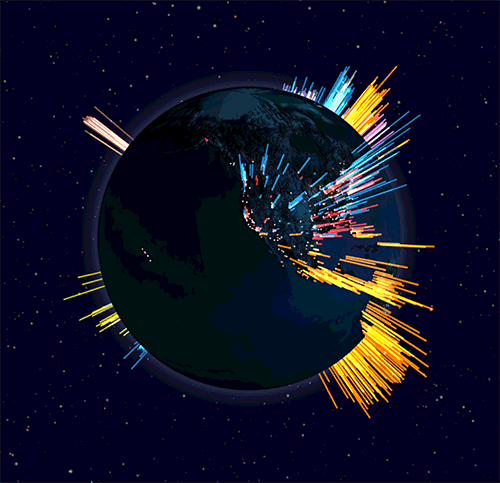
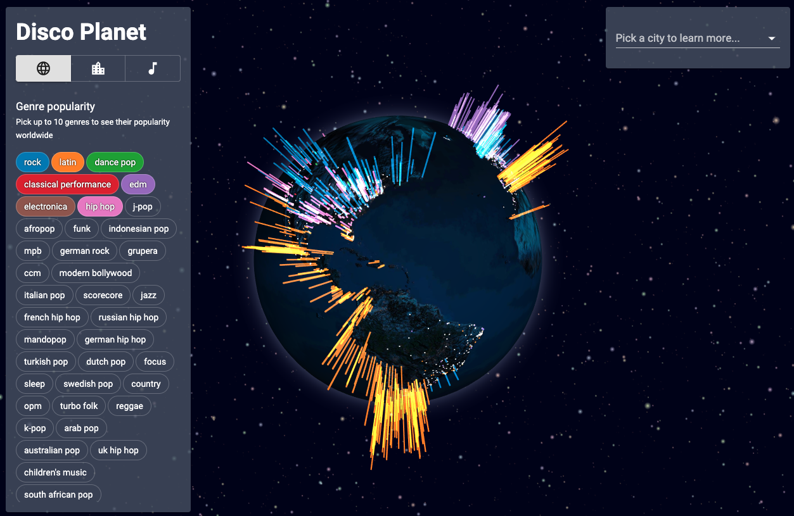

  

  
  

  

    <strong>Disco Planet</strong>
  

  

    <a href=https://go.aws/3ekQWjO>
      Website
    </a>
  

# Disco Planet | Project for COM-480 Data Visualization

## Abstract
Modern means of communication and transportation have brought the world closer together. With many cities turning into melting pots, cultural, social, and personal motives [drive people's curiosity](https://comms.theculturetrip.com/wp-content/uploads/2019/05/Culture-Trip-Beyond-Borders-May-2019-Final.pdf) to explore how diverse backgrounds and experiences intertwine and blur geographical borders. Since [music plays a central role in cultural identity](https://doi.org/10.1007/s10824-018-9320-x), our project strives to provide these insights by looking into the musical preferences of people around the globe.

For the Disco Planet project we employed the dataset retrieved from [Spotify](https://developer.spotify.com/documentation/web-api/), the [most popular music streaming service](https://www.fipp.com/news/insightnews/chart-week-world-most-popular-music-streaming-services) in the year 2019. The three visualization views address the following major questions:

1. What music genres are popular in different corners of the world?
2. How various cities are similar or different in their musical preferences?
3. How do numerous genres and sub-genres of music relate to each other?

We expect that both the general audience and more inquiring music lovers will engage with our website and learn curious insights during the interaction.

## Screen cast

